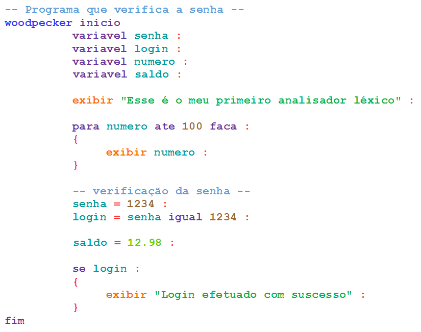

#### Woodpecker Lexical Analyzer

Woodpecker is a simple lexical analyzer written in Python used to explain a lexical convention on the study of compilers.

#### Lexical Specification

Source code

Conventions table

| Color       | Description                                          |
|-------------|------------------------------------------------------|
| Azul        | Nome da linguagem de programação – palavra reservada |
| Roxo        | Palavras reservadas                                  |
| Laranja     | Identificadores (variável ou procedimento)           |
| Verde       | Constante literal                                    |
| Azul-claro  | Constante inteira                                    |
| Vermelho    | Marcador de final de linha                           |
| Entre -- -- | Entre Comentários                                    |

#### Files

`woodpecker.language`: Source code of programming language.

`woodpecker.py`: Implementation of the lexical analysis(scanning).

`test_woodpecker.py`: Unit test of the lexical specification.
